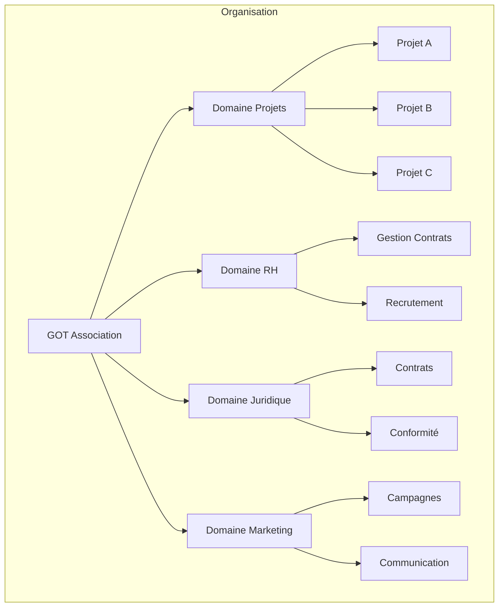
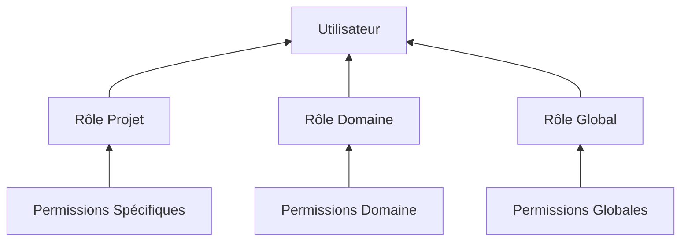
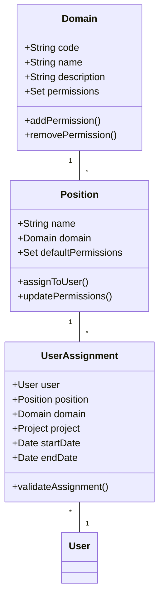
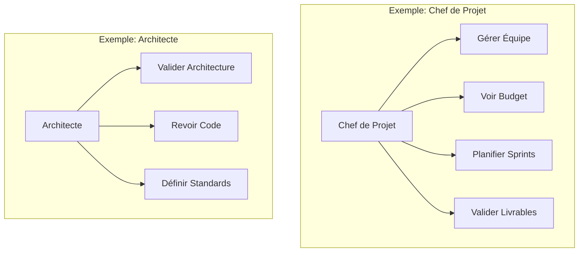
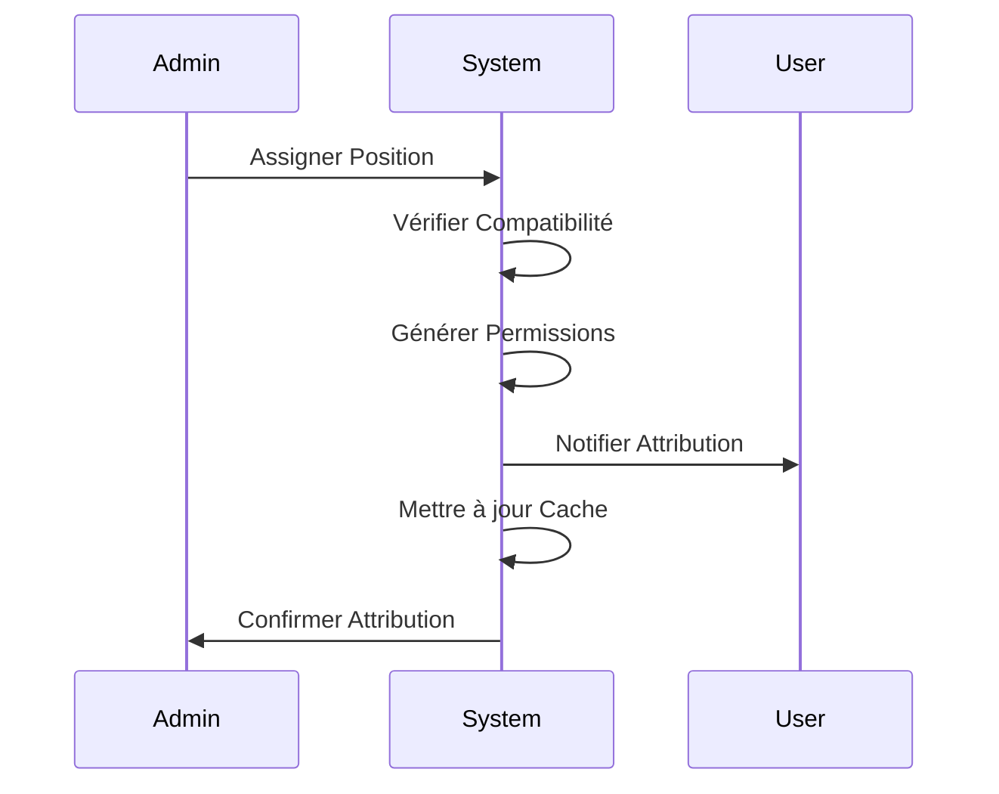
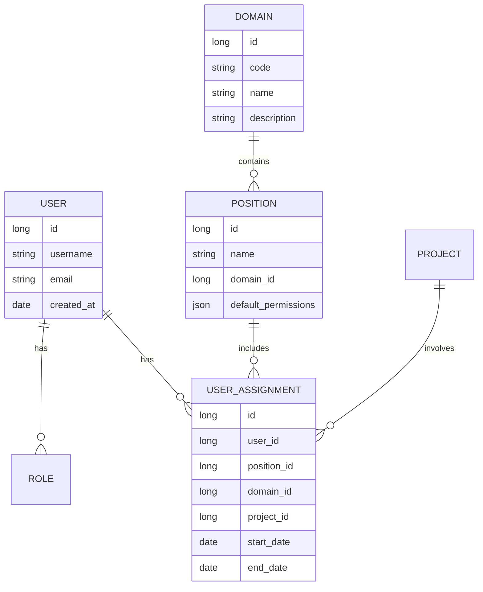
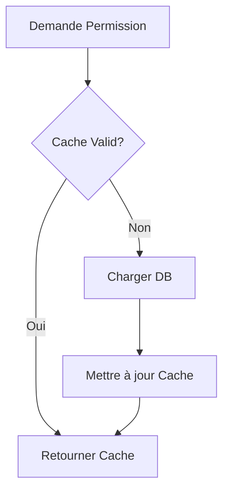
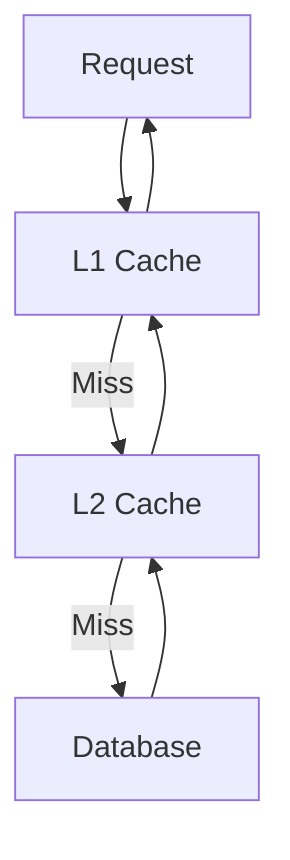

# Système de Gestion des Permissions GOT ERP

## Introduction

Le système de gestion des permissions de GOT ERP est conçu pour gérer de manière flexible et sécurisée les accès aux différentes fonctionnalités de l'application. Ce document présente l'architecture et l'implémentation de ce système.

### Description Générale

Dans une association IT comme GOT, les membres peuvent avoir différents rôles et responsabilités qui se chevauchent souvent. Par exemple, une même personne peut être à la fois chef de projet sur un projet et architecte technique sur un autre. Le système doit donc pouvoir gérer ces cas de figure tout en maintenant une sécurité et une clarté optimales.

### Exemples Concrets

#### Exemple 1 : Sarah, Développeuse Senior
Sarah travaille sur deux projets différents avec des responsabilités distinctes :
- Sur le "Projet A" : Chef de Projet
  - Peut gérer l'équipe
  - Peut voir et modifier le budget
  - Peut planifier les sprints
- Sur le "Projet B" : Architecte Technique
  - Peut valider les choix techniques
  - Peut revoir le code
  - Ne peut pas gérer le budget

#### Exemple 2 : Mohamed, Responsable RH et Marketing
Mohamed a des responsabilités dans deux domaines différents :
- Dans le domaine RH :
  - Peut gérer les contrats
  - Peut valider les recrutements
- Dans le domaine Marketing :
  - Peut gérer les campagnes marketing
  - Peut approuver les communications externes

## Table des matières
- [Vue d'ensemble](#vue-densemble)
- [Aspects Fonctionnels](#aspects-fonctionnels)
- [Architecture Technique](#architecture-technique)
- [Sécurité et Performance](#sécurité-et-performance)
- [Guides d'Implémentation](#guides-dimplémentation)

## Vue d'ensemble

### Contexte
GOT ERP est un système de gestion d'entreprise multi-domaines qui nécessite une gestion fine des accès et des permissions. L'application doit gérer différents domaines (Projets, RH, Juridique, Marketing, etc.) avec des utilisateurs pouvant avoir plusieurs positions dans différents contextes.

### Structure Organisationnelle

> **Note**: Le diagramme suivant est un exemple de structure organisationnelle. La structure réelle peut être adaptée selon les besoins spécifiques de l'organisation.



**Explication du diagramme** :
- Le diagramme montre la structure hiérarchique de l'organisation
- Chaque domaine (Projets, RH, etc.) contient ses propres sous-domaines
- Le domaine Projets est particulier car il contient des projets spécifiques
- Cette structure permet une séparation claire des responsabilités

### Hiérarchie des Permissions

> **Note**: Ce diagramme illustre comment les différents niveaux de permissions s'accumulent pour un utilisateur.



**Explication du diagramme** :
- Les permissions sont organisées en trois niveaux
- Niveau 1 (Global) : Permissions de base dans l'application
- Niveau 2 (Domaine) : Permissions spécifiques à un domaine
- Niveau 3 (Projet) : Permissions spécifiques à un projet
- Un utilisateur hérite des permissions de tous les niveaux

### Cas d'Utilisation Typique

Prenons l'exemple de Julie, qui vient d'être assignée comme Chef de Projet sur le "Projet X" :

1. **Attribution initiale**
   - L'administrateur crée une nouvelle assignation pour Julie
   - Le système vérifie la compatibilité avec ses rôles existants
   - Les permissions sont générées automatiquement

2. **Utilisation quotidienne**
   - Julie se connecte à l'application
   - Le système charge ses permissions en cache
   - L'interface s'adapte à ses droits d'accès

3. **Changement de rôle**
   - Julie devient également Architecte sur le "Projet Y"
   - Le système ajoute les nouvelles permissions
   - Le cache est invalidé et mis à jour

## Aspects Fonctionnels

### 1. Gestion des Domaines

#### 1.1 Domaines Principaux
- **Projets IT**
  - Gestion des équipes
  - Suivi des développements
  - Revues techniques
  - Déploiements

- **Ressources Humaines**
  - Gestion des contrats
  - Processus de recrutement
  - Évaluation des performances
  - Formation

- **Juridique**
  - Gestion des contrats
  - Conformité réglementaire
  - Propriété intellectuelle

- **Marketing**
  - Campagnes marketing
  - Communication externe
  - Événements



**Explication du diagramme de classes** :
- Ce diagramme montre les relations entre les principales entités du système
- Un Domain peut avoir plusieurs Positions
- Une Position peut être assignée à plusieurs utilisateurs via UserAssignment
- UserAssignment fait le lien entre User, Position, Domain et Project
- Les dates permettent de garder un historique des assignations

#### 2.2 Matrice des Permissions
> **Note**: Les exemples suivants illustrent les permissions typiques pour certaines positions. Les permissions réelles peuvent être adaptées selon les besoins.



**Explication du diagramme** :
- Montre les permissions typiques associées à chaque position
- Les permissions sont organisées hiérarchiquement
- Chaque position a des permissions spécifiques à son domaine
- Les permissions peuvent se chevaucher entre positions

### 3. Flux Fonctionnels

#### 3.1 Attribution de Position
> **Note**: Ce diagramme illustre le processus d'attribution d'une nouvelle position à un utilisateur.



**Explication du diagramme de séquence** :
- Montre les étapes d'attribution d'une position
- Met en évidence les vérifications de sécurité
- Illustre la mise à jour automatique du cache
- Inclut la notification des parties concernées

## Architecture Technique

### 1. Modèle de Données Détaillé



**Explication du modèle de données** :
- Montre les relations entre les entités principales
- Chaque utilisateur peut avoir plusieurs rôles et positions
- Les positions sont liées à des domaines et des projets
- Les dates permettent de garder un historique des assignations

### 2. Implémentation du Cache

#### 2.1 Structure du Cache
```java
public class PermissionCacheKey {
    private final Long userId;
    private final String domain;
    private final String context;  // "GLOBAL", "DOMAIN", "PROJECT"
    
    // Constructeur et méthodes
}

public class PermissionCacheValue {
    private final Set<String> permissions;
    private final Instant lastUpdated;
    private final Instant expiresAt;
    
    // Constructeur et méthodes
}
```

**Explication de la structure du cache** :
- Le cache est organisé par clés et valeurs
- Les clés sont composées de l'ID de l'utilisateur, du domaine et du contexte
- Les valeurs contiennent les permissions associées à la clé
- Les dates permettent de gérer la validité du cache

#### 2.2 Stratégie de Cache


**Explication de la stratégie de cache** :
- Le cache est vérifié avant de charger les données de la base de données
- Si le cache est valide, les données sont retournées directement
- Si le cache n'est pas valide, les données sont chargées de la base de données et le cache est mis à jour

## Sécurité et Performance

### 1. Mesures de Sécurité

#### 1.1 Validation des Tokens
```java
@Aspect
@Component
public class PermissionValidationAspect {
    @Around("@annotation(requiresPermission)")
    public Object validatePermission(ProceedingJoinPoint joinPoint, 
                                   RequiresPermission requiresPermission) {
        // Validation logique
    }
}
```

**Explication de la validation des tokens** :
- Les tokens sont validés avant d'accéder à une ressource
- La validation est effectuée à l'aide d'un aspect
- Les annotations sont utilisées pour spécifier les permissions requises

#### 1.2 Audit Trail
```java
@Entity
public class PermissionAuditLog {
    @Id
    private Long id;
    
    private String action;      // "GRANT", "REVOKE", "MODIFY"
    private String domain;
    private String position;
    private String permission;
    private String modifiedBy;
    private Instant timestamp;
}
```

**Explication de l'audit trail** :
- Les modifications des permissions sont enregistrées dans un journal d'audit
- Le journal d'audit contient les informations sur l'action effectuée
- Les dates permettent de garder un historique des modifications

### 2. Optimisations de Performance

#### 2.1 Cache Hierarchy


**Explication de la hiérarchie de cache** :
- Le cache est organisé en plusieurs niveaux
- Les requêtes sont d'abord vérifiées dans le cache de niveau 1
- Si le cache de niveau 1 n'est pas valide, les requêtes sont vérifiées dans le cache de niveau 2
- Si le cache de niveau 2 n'est pas valide, les données sont chargées de la base de données

## Guides d'Implémentation

### 1. Création d'un Nouveau Domaine
```java
@Service
public class DomainService {
    public Domain createDomain(DomainDTO dto) {
        // Validation
        validateDomainCreation(dto);
        
        // Création
        Domain domain = new Domain();
        domain.setCode(dto.getCode());
        domain.setName(dto.getName());
        
        // Permissions par défaut
        domain.setDefaultPermissions(generateDefaultPermissions());
        
        return domainRepository.save(domain);
    }
}
```

**Explication de la création d'un nouveau domaine** :
- La création d'un nouveau domaine est effectuée via un service
- Les données sont validées avant de créer le domaine
- Les permissions par défaut sont générées automatiquement

### 2. Attribution de Position
```java
@Service
public class PositionAssignmentService {
    public UserAssignment assignPosition(AssignmentDTO dto) {
        // Validation
        validateAssignment(dto);
        
        // Création assignment
        UserAssignment assignment = new UserAssignment();
        assignment.setUser(userRepository.getById(dto.getUserId()));
        assignment.setPosition(positionRepository.getById(dto.getPositionId()));
        
        // Vérification compatibilité
        validateCompatibility(assignment);
        
        // Sauvegarde
        return assignmentRepository.save(assignment);
    }
}
```

**Explication de l'attribution de position** :
- L'attribution de position est effectuée via un service
- Les données sont validées avant d'attribuer la position
- La compatibilité est vérifiée avant de sauvegarder l'attribution

### 3. Exemple d'Utilisation Frontend
```typescript
// Hook personnalisé pour la gestion des permissions
function usePermissions(domain: string) {
    const [permissions, setPermissions] = useState<string[]>([]);
    const [loading, setLoading] = useState(true);
    
    useEffect(() => {
        async function loadPermissions() {
            const perms = await permissionCache.getForDomain(domain);
            setPermissions(perms);
            setLoading(false);
        }
        
        loadPermissions();
    }, [domain]);
    
    return { permissions, loading };
}

// Composant utilisant les permissions
function ProjectDashboard() {
    const { permissions, loading } = usePermissions('PROJECTS');
    
    if (loading) return <Loading />;
    
    return (
        <div>
            {permissions.includes('VIEW_DASHBOARD') && (
                <DashboardContent />
            )}
            {permissions.includes('MANAGE_TEAM') && (
                <TeamManagement />
            )}
        </div>
    );
}
